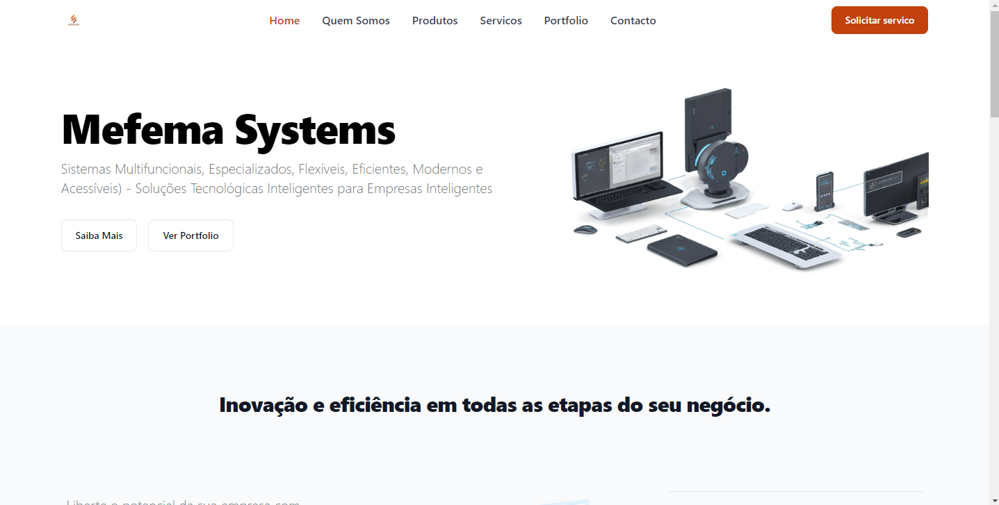

# Mefema Systems

**Sistemas Multifuncionais, Especializados, Flexíveis, Eficientes, Modernos e Acessíveis - Soluções Tecnológicas Inteligentes para Empresas Inteligentes**

## Sobre o Projecto

Mefema Systems oferece soluções tecnológicas inovadoras para empresas que procuram maximizar a eficiência e o desempenho. O nosso website apresenta as diversas soluções que disponibilizamos, desde websites modernos e responsivos a sistemas de gestão personalizados, aplicativos multi-plataformas, soluções de inteligência artificial, e integração com IoT. A nossa missão é simplificar as operações empresariais, reduzir tarefas manuais e ajudar as empresas a implementar mudanças com facilidade.

- **Website**: [www.mefemasys.co.mz](http://www.mefemasys.co.mz)
- **Tecnologias Utilizadas**: Vue.js + Vite
- **Licença**: MIT


## Funcionalidades

### Soluções de Software Inteligentes

- Websites Modernos e Responsivos
- Sistemas de Gestão Personalizados
- Aplicativos Multi Plataformas (Web, Mobile e Desktop)
- Soluções de Inteligência Artificial (IA)
- Integração com IoT

### Suporte Técnico Especializado

- Assistência Técnica e Consultoria Personalizada em IT
- Serviços de Helpdesk
- Gestão e Administração de Sistemas
- Instalação e Montagem de Infraestruturas de Rede
- Configuração e Manutenção de Equipamentos Informáticos

## Estrutura de Pastas

```plaintext
.
├── public              # Ficheiros públicos (imagens, ícones, etc.)
├── src                 # Código-fonte principal
│   ├── assets          # Recursos como imagens, estilos, etc.
│   ├── components      # Componentes Vue reutilizáveis
│   ├── views           # Vistas do website
│   ├── pages           # Páginas do website
│   ├── plugins         # Configurações diversas
│   ├── store           # Gerenciamento de estado Vuex
│   ├── App.vue         # Componente principal da aplicação
│   ├── main.js         # Entrada principal da aplicação
│   └── styles          # Estilos globais
└── vite.config.js      # Configuração do Vite

```

## Como Executar o Projecto Localmente

Para executar o projecto localmente, siga os passos abaixo:

1. **Clone o repositório:**

   ```bash
    git clone https://github.com/mmaunze/mefema-systems-website.git
    cd mefema-systems-webiste
   ```

2. **Instale as dependências:**

   ```bash
    npm install
   ```

3. **Inicie o servidor de desenvolvimento:**

   ```bash
    npm run dev
   ```

4. **Abra no navegador:**

   A aplicação estará disponível em `http://localhost:5173`.

## Informações da Empresa

Mefema Systems é uma empresa dedicada a fornecer soluções tecnológicas de ponta para transformar e otimizar a gestão empresarial. Com uma equipa de especialistas em diversas áreas de TI, oferecemos serviços completos desde a consultoria até à implementação e suporte técnico.

- **Sobre**: Saiba mais sobre a nossa história e missão.
- **Quem Somos**: Conheça a nossa equipa e valores.
- **Portfolio**: Veja os nossos projectos de sucesso e inspire-se.

## Produtos e Serviços

- **Produtos de Software**: Sistema de Gestão, Aplicações Mobile, Soluções Cloud.
- **Serviços de Suporte**: Assistência Técnica, Consultoria, Formação e Treinamento.
- **Recursos e Documentação**: Acesso a documentação, FAQs e tutoriais.

## Suporte

Caso necessite de suporte técnico ou tenha dúvidas sobre as nossas soluções, entre em contacto connosco através do website ou envie um e-mail para <suporte@mefemasys.co.mz>.
